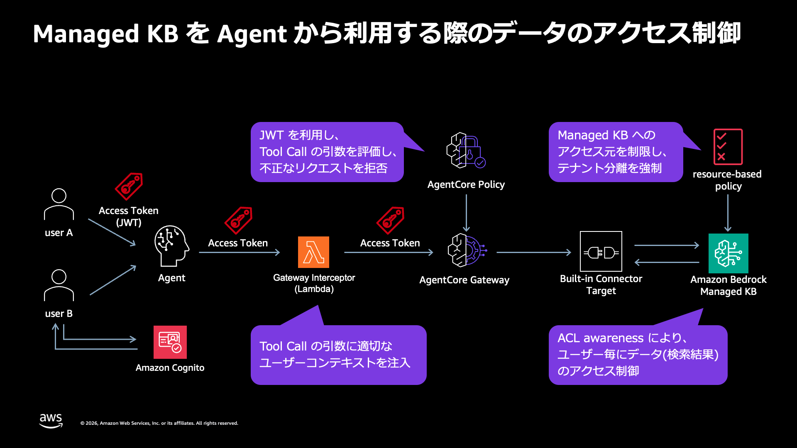
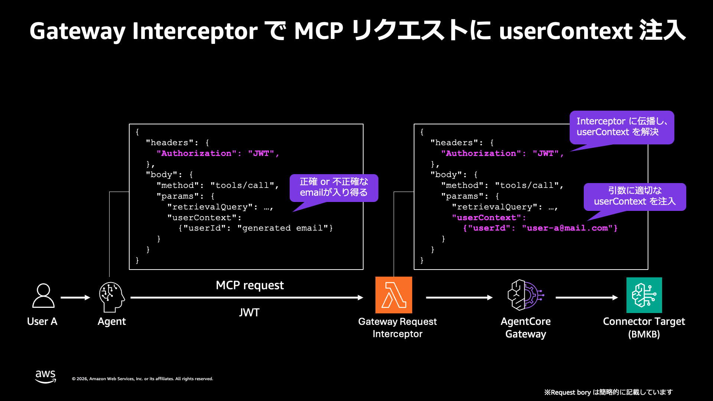

# Managed Knowledge Base を AgentCore Gateway で MCP Tool として利用する際のデータのアクセス制御

Amazon Bedrock Managed Knowledge Base を AgentCore Gateway のコネクタターゲットで MCP ツール化し、REQUEST Interceptor で `userContext` を注入して ACL-aware retrieval をユーザー毎に成立させる検証コードを公開している。基本形の fgac-interceptor に加え、AgentCore Policy (Cedar) で注入結果を検証する advanced-policy、KB のリソースベースポリシーでアクセス経路自体を制限する resource-based-policy の 2 つの発展形を含む。各構成は独立した CDK スタック 1 つで自己完結する。



解説記事: [Bedrock Managed Knowledge Base を MCP Tool として利用する際のテナント分離・アクセス制御まとめ](https://zenn.dev/aws_japan/articles/007-bedrock-agentcore-gateway-managed-kb-mcp)

## 構成

```
fgac-interceptor/               基本形: FGAC (ACL + メタデータフィルタリング) を Interceptor 注入で成立させる構成
  cdk/                          S3 + Managed KB + Cognito + Gateway + REQUEST Interceptor + テスト文書 (AWS CDK, TypeScript)
  agent/                        Agent クライアントと検証スクリプト (Strands Agents, Python)。run.sh が実行ヘルパー
advanced-policy/                発展形: AgentCore Policy (Cedar) で注入後の userContext を検証する多層防御構成 (詳細は advanced-policy/README.md)
  cdk/                          基本形 + Pre Token Generation Lambda + Policy Engine + 検証用 Gateway
  agent/                        Policy の deny 観測を含む検証スクリプト
resource-based-policy/          発展形: KB のリソースベースポリシーでバイパス経路を遮断する構成 (詳細は resource-based-policy/README.md)
  cdk/                          advanced-policy + KB リソースベースポリシー + rogue ロール / Gateway
  agent/                        バイパス経路の遮断確認を含む検証スクリプト
```

スタックが作成するリソース: S3 バケット (テスト文書 + ACL サイドカー + global ACL ファイルを自動配置) / Managed Knowledge Base (type: MANAGED) + ACL 有効 S3 データソース x2 (文書毎メタデータ方式 / global ACL ファイル方式) / IAM ロール x2 (KB サービスロール / Gateway 実行ロール) / Cognito user pool + ドメイン (userInfo エンドポイント) + app client + テストユーザー x2 / テストユーザーパスワードの Secrets Manager シークレット + パスワード設定用 AwsCustomResource / REQUEST Interceptor Lambda / AgentCore Gateway (CUSTOM_JWT) + Managed KB connector target。target は `Retrieve` (単発検索) と `AgenticRetrieveStream` (マルチステップ検索) の 2 ツールを公開する。

## フィルタリングの 3 方式

Managed KB のユーザー毎の絞り込みには、global ACL (プレフィックス単位)、文書毎の ACL (文書単位)、メタデータフィルタリング (属性単位) の 3 方式がある。前者 2 つはクエリ時の `userContext` で、最後はクエリ時の `filter` で制御する。本スタックは ACL の 2 方式をデータソースを分けて検証し、メタデータフィルタリングは文書毎 ACL と同じサイドカーで併用する。

| 方式                     | データソース (プレフィックス)  | 定義場所                                                                                  | テスト文書                                                         |
| ------------------------ | ------------------------------ | ----------------------------------------------------------------------------------------- | ------------------------------------------------------------------ |
| global ACL               | `global-docs` (`global-docs/`) | `acl-config/global-acl.json`                                                              | finance/budget (user-a) / hr/rules (user-b) / no-acl/ (ACL なし)   |
| 文書毎の ACL             | `docs` (`docs/`)               | `{ファイル名}.metadata.json` の `accessControlList` (例: `dept-a-plan.txt.metadata.json`) | dept-a-plan (user-a) / dept-b-plan (user-b) / shared-notice (両者) |
| メタデータフィルタリング | `docs` (`docs/`)               | 同じサイドカーの `metadataAttributes`                                                     | 下表の department / year 属性                                      |

global ACL ファイルは文書の絶対 S3 URI で対象を指定するため静的アセットにできず、CDK が `s3deploy.Source.jsonData` でバケット名を埋め込んで生成する。`global-docs/no-acl/` 配下の文書はどの `keyPrefix` にも該当せずサイドカーも持たないため取り込まれない (fail-closed の確認用。2026 年 8 月の実測ではインジェストは COMPLETE で完了し、3 件スキャン中 2 件のみがインデックスされる)。

`docs` 側のサイドカーは `accessControlList` (ACL) と `metadataAttributes` (属性) の両方を持ち、ACL とメタデータフィルタリングの併用を確認できる。

| 文書          | ACL            | department | year |
| ------------- | -------------- | ---------- | ---- |
| dept-a-plan   | user-a         | `d001`     | 2026 |
| dept-b-plan   | user-b         | `d002`     | 2026 |
| shared-notice | user-a, user-b | `shared`   | 2025 |

属性値に区切り文字 (ハイフン / アンダースコア) を含めていないのは意図的である。`equals` の文字列比較はトークン分割 + ストップワード除去で評価されるため、`dept-a` のような値は他の `dept-*` 文書にも誤マッチする。

filter は Gateway のツールスキーマには公開していない。Target の `parameterOverrides` で visible にしているのは `$.userContext` のみで、検索クエリ (`retrievalQuery` / `messages`) はコネクタ既定でスキーマに現れる。アクセス制御を担う値を LLM に組み立てさせないという設計方針であり、filter の検証は `Retrieve` API 直接で行う。

## 認証と userContext の解決 (OAuth 2.0 準拠)



クライアントが送るのは Authorization ヘッダーのアクセストークン 1 つだけで、標準的な OAuth 2.0 の bearer 認証と同じ形になる。

1. Gateway の JWT authorizer (`allowedClients`) がアクセストークンの署名・有効期限・client_id を検証する
2. REQUEST Interceptor が、その検証済みアクセストークン自身の権限でユーザーの email を解決する
3. Interceptor が email を `tools/call` の `arguments.userContext` に強制設定する (クライアント指定値は上書き)

email の出所がアクセストークン自身の権限で取得した情報になるため、認証された主体と userContext の主体は構造的に乖離しない。解決結果は Lambda 実行環境のプロセス内キャッシュ (sub -> email、TTL 5 分) で再利用している。実行環境の再利用に相乗りする確率的キャッシュであり、ミス時は解決し直すだけなので正確性には影響しない。

email の解決先はトークンのスコープに応じて 2 段構えになっている。`openid` スコープを持つトークン (Hosted UI の 3LO 等) は OIDC 標準の userInfo エンドポイントで、持たないトークン (`USER_PASSWORD_AUTH` の `aws.cognito.signin.user.admin` スコープ) は Cognito の GetUser API で解決する。Cognito の userInfo は `openid` スコープを要求し、`USER_PASSWORD_AUTH` のトークンには `openid` が含まれないため、単一の解決先では両方のトークンを受けられない。

## デプロイ

```bash
cd fgac-interceptor/cdk
npm install
npx cdk deploy ManagedKbGatewayStack --outputs-file outputs.json
```

テストユーザー (user-a@example.com / user-b@example.com) もスタックが作成する。パスワードは初回デプロイ時に Secrets Manager (`managed-kb-test-user-password`) に自動生成され、リポジトリやテンプレートには現れない。CloudFormation ネイティブ (`CfnUserPoolUser`) では恒久パスワードを設定できないため、`AwsCustomResource` による `adminSetUserPassword` (Permanent: true) を併用しており、デプロイ直後から `USER_PASSWORD_AUTH` で認証できる。

```bash
# テストユーザーのパスワードの取得
aws secretsmanager get-secret-value \
  --secret-id managed-kb-test-user-password --query 'SecretString' --output text
```

## セットアップ (デプロイ後に 1 回)

2 つのデータソースの同期 (ingestion) を実行する。Managed KB の同期は非同期のため、順番に実行する。

```bash
# 文書毎メタデータ方式
aws bedrock-agent start-ingestion-job \
  --knowledge-base-id <KbId> --data-source-id <DataSourceId>

# global ACL ファイル方式 (完了後に実行)
aws bedrock-agent start-ingestion-job \
  --knowledge-base-id <KbId> --data-source-id <GlobalDataSourceId>
```

`global-docs` 側は `no-acl/` の文書が意図的に ACL 未定義なので、3 件スキャン中 2 件のみがインデックスされるのが正常な結果である (2026 年 8 月の実測では `numberOfNewDocumentsIndexed: 2`、`numberOfDocumentsFailed: 0` の COMPLETE)。

## Agent の実行

`fgac-interceptor/agent/run.sh` が `fgac-interceptor/cdk/outputs.json` から Gateway URL / KB ID / Cognito 設定を読み、Secrets Manager のパスワードでアクセストークンを発行してから各スクリプトを実行する。ユーザーは各サブコマンド末尾の引数 `a` / `b` で切り替える (既定は `a`。`tools` / `verify-injection` も同様に引数を取る)。

```bash
./fgac-interceptor/agent/run.sh agent "A部門の事業計画に記載されている計画管理コードは何ですか？"      # 方式 1
./fgac-interceptor/agent/run.sh hook  "B部門の事業計画に記載されている計画管理コードは何ですか？" b   # 方式 2
./fgac-interceptor/agent/run.sh tools          # tools/list (公開スキーマの確認)
./fgac-interceptor/agent/run.sh token b        # アクセストークンの表示
./fgac-interceptor/agent/run.sh                # 使い方の表示
```

トークンを自分で発行して個々のスクリプトを直接叩く場合は以下のとおり。パスワードは記号を含むため、ショートハンド形式ではなく JSON で渡す。

```bash
# アクセストークンの取得
PASSWORD=$(aws secretsmanager get-secret-value \
  --secret-id managed-kb-test-user-password --query 'SecretString' --output text)
jq -n --arg p "$PASSWORD" \
  '{USERNAME: "user-a@example.com", PASSWORD: $p}' > /tmp/auth-params.json
aws cognito-idp initiate-auth --auth-flow USER_PASSWORD_AUTH \
  --client-id <UserPoolClientId> \
  --auth-parameters file:///tmp/auth-params.json \
  --query 'AuthenticationResult.AccessToken' --output text

# Agent の実行 (方式 1: Interceptor 構成)
uv run python fgac-interceptor/agent/agent_interceptor.py \
  --gateway-url <outputs.json の GatewayUrl> \
  --access-token <ACCESS_TOKEN> \
  --prompt "A部門の事業計画に記載されている計画管理コードは何ですか？"

# Agent の実行 (方式 2: アプリ側フック構成。GetUser で email を解決)
uv run python fgac-interceptor/agent/agent_hook.py \
  --gateway-url <outputs.json の GatewayUrl> \
  --access-token <ACCESS_TOKEN> \
  --prompt "A部門の事業計画に記載されている計画管理コードは何ですか？"
```

user-a は A 部門文書 (ヤマセミ-1101) のみ、user-b は B 部門文書 (クマタカ-2202) のみが検索でき、共有通知 (ハヤブサ-3303) は両者が検索できる。プロンプトで userContext の詐称を指示しても、Gateway の Interceptor がアクセストークンから解決した email で上書きするため他部門の文書は返らない。

global ACL 方式でも同じく、user-a は財務部の予算資料 (トビ-8808) のみ、user-b は人事部の就業規則 (ノスリ-9909) のみを検索できる。ACL 未定義の未分類メモ (フクロウ-5505) は取り込まれていないため誰にも返らない。

## 検証スクリプト

```bash
./fgac-interceptor/agent/run.sh verify-all               # 以下 3 つを一括実行
./fgac-interceptor/agent/run.sh verify-injection         # userContext の注入・詐称防止・無効トークンの拒否
./fgac-interceptor/agent/run.sh verify-global-acl        # global ACL 方式のフィルタリングマトリクス
./fgac-interceptor/agent/run.sh verify-metadata-filter   # メタデータフィルタリングと ACL の併用
```

個別に実行する場合は以下のとおり。

```bash
# userContext の注入・詐称防止・無効トークンの拒否 (Gateway 経由)
uv run python fgac-interceptor/agent/verify_usercontext_injection.py \
  --gateway-url <GatewayUrl> --access-token-a <user-a の ACCESS_TOKEN>

# global ACL 方式のフィルタリングマトリクス (Retrieve API 直接)
uv run python fgac-interceptor/agent/verify_global_acl.py --kb-id <KbId>

# メタデータフィルタリングと ACL の併用 (Retrieve API 直接)
uv run python fgac-interceptor/agent/verify_metadata_filter.py --kb-id <KbId>
```

`verify_metadata_filter.py` は 2 段構成で検証する。前半は filter の基本動作 (`equals` / `andAll` / `greaterThan`)、後半は ACL と filter が独立した 2 つのゲートとして AND で効くことの切り分けである。ACL 許可 + filter 不一致が 0 件になることで「ACL 優先」仮説が、ACL 拒否 + filter 一致が 0 件になることで「filter 優先」仮説が、それぞれ棄却される。あわせて customer-managed KB の `vectorSearchConfiguration.filter` 構文が Managed KB では拒否されることも確認する。
