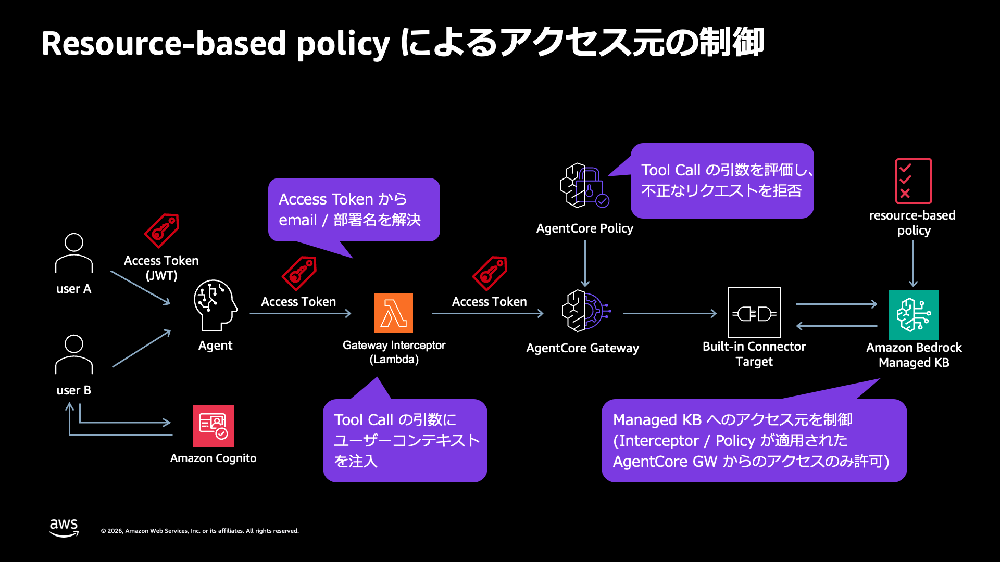

# リソースベースポリシーによる KB 側 (asset-side) のアクセス制限

advanced-policy (Interceptor + AgentCore Policy) をベースに、Managed KB 自体にアタッチする[リソースベースポリシー](https://docs.aws.amazon.com/bedrock/latest/userguide/kb-managed-cross-account.html)を経路非依存の第 3 レイヤーとして追加した構成。Gateway 側の制御 (Interceptor / Cedar Policy) は「その Gateway を通るリクエスト」しか守れない。KB 側のリソースベースポリシーは「正規 Gateway 実行ロール以外の `bedrock:Retrieve` / `bedrock:GetDocumentContent` を明示 Deny」することで、直接 API 呼び出しや Interceptor を持たない別 Gateway といったバイパス経路を KB の手前で遮断する。



公式ドキュメントが示すリソースベースポリシーの用途はクロスアカウントアクセスの許可だが、Allow と Deny の両方をサポートし、明示 Deny は同一アカウント内の identity ポリシーの Allow も上書きする。本構成はこれを同一アカウント内のアクセス制限として利用し、実機検証した。

## ベース構成 (advanced-policy) との差分

- KB にリソースベースポリシーをアタッチする custom resource (`bedrock-agent` の `PutResourcePolicy` / 削除時 `DeleteResourcePolicy`) を追加。CloudFormation のリソースタイプは存在しない
- バイパス経路をシミュレートする rogue ロール (`managed-kb-rbp-rogue-role`) を追加。identity ポリシーでは KB のデータアクション全てと `bedrock:GetKnowledgeBase` (ケース 6 の control-plane 確認用) を Allow しており、リソースベースポリシーの Deny だけが遮断要因になる。bedrock-agentcore (rogue Gateway の実行) とアカウント (検証スクリプトの AssumeRole) の両方を信頼する
- 検証用 Gateway を「Interceptor なし・Policy Engine なし・rogue ロールで実行」の rogue Gateway に変更。記事中の「Interceptor を持たない Gateway が同じ KB 向けに追加される」脅威シナリオそのもので、advanced-policy の検証用 Gateway (Policy 単体の deny 観測用) とは目的が異なる
- メイン Gateway 側の構成 (Pre Token Generation / Interceptor / Cedar Policy 2 本) は advanced-policy と同一 (リソース名のプレフィックスのみ managed-kb-rbp-* に変更)。advanced-policy にあった検証用 Gateway 向けの 3 本目の Cedar Policy は、rogue Gateway に Policy Engine を紐付けないため存在しない

## リソースベースポリシーの内容

```json
{
  "Version": "2012-10-17",
  "Statement": [
    {
      "Sid": "DenyRetrieveExceptGatewayRole",
      "Effect": "Deny",
      "Principal": "*",
      "Action": ["bedrock:Retrieve", "bedrock:GetDocumentContent"],
      "Resource": "<KB ARN>",
      "Condition": {
        "ArnNotEquals": { "aws:PrincipalArn": "<Gateway 実行ロールの ARN>" }
      }
    }
  ]
}
```

`aws:PrincipalArn` はロールセッションに対してロール ARN (assumed-role のセッション ARN ではない) に解決されるため、単一の ARN 指定で Gateway 実行ロールの全セッションが除外される。

リソースベースポリシーの仕様上の制約 (`bedrock:AgenticRetrieveStream` を含む Put の拒否のみケース 8 で実測、他は公式ドキュメント):

- 記載できるアクションは `bedrock:Retrieve` と `bedrock:GetDocumentContent` のみ。`bedrock:AgenticRetrieveStream` や control-plane 操作 (`GetKnowledgeBase` 等) は記載できない
- `Action` / `Resource` にワイルドカードは使えない (KB の完全な ARN とアクションの明示列挙が必要)
- アタッチできるのは type MANAGED の KB のみ (VECTOR は不可)

## 多層防御の構成

| レイヤー                          | 役割                                                                    | 守備範囲                   |
| --------------------------------- | ----------------------------------------------------------------------- | -------------------------- |
| REQUEST Interceptor               | JWT の email クレームから userContext を強制注入                        | メイン Gateway を通る経路  |
| AgentCore Policy (Cedar, ENFORCE) | 注入後の userContext と JWT の email の一致を検証                       | メイン Gateway を通る経路  |
| KB リソースベースポリシー         | 正規 Gateway 実行ロール以外の Retrieve / GetDocumentContent を明示 Deny | KB への全経路 (経路非依存) |

## デプロイ

```bash
cd resource-based-policy/cdk
npm install
npx cdk deploy ManagedKbRbpStack --outputs-file outputs.json

# ingestion (デプロイ後に 1 回)
aws bedrock-agent start-ingestion-job \
  --knowledge-base-id <KbId> --data-source-id <DataSourceId>
```

リソースベースポリシーの custom resource は両 Gateway Target の作成完了後に実行される。Target 作成時のバリデーション (実行ロールでの KB アクセス確認) を検証対象のポリシーと切り離すためで、「バイパス経路が先に存在し、後から KB 側の制御で遮断する」という脅威シナリオの時系列にも一致する。

## 検証

```bash
./resource-based-policy/agent/run.sh verify-rbp   # 9 ケースの一括検証
./resource-based-policy/agent/run.sh tools        # 正規 GW の tools/list
./resource-based-policy/agent/run.sh agent "A部門の事業計画に記載されている計画管理コードは何ですか？"
./resource-based-policy/agent/run.sh token b      # アクセストークンの表示
```

ユーザーは各サブコマンド末尾の引数 `a` / `b` で切り替える (既定は `a`)。

verify-rbp の検証内容:

| #   | 経路                        | 操作                             | 期待                                                   |
| --- | --------------------------- | -------------------------------- | ------------------------------------------------------ |
| 0   | デプロイヤ                  | GetResourcePolicy                | Sid DenyRetrieveExceptGatewayRole がアタッチされている |
| 1   | 正規 GW                     | kb___Retrieve                    | 正規経路は Deny の影響を受けずヒット                   |
| 2   | 正規 GW                     | kb___AgenticRetrieveStream       | 正規経路の agentic 検索も動く                          |
| 3   | デプロイヤ (管理者)         | Retrieve 直接                    | 明示 Deny (同一アカウントの管理者も遮断)               |
| 4   | rogue ロール                | Retrieve 直接                    | identity の Allow を明示 Deny が上書き                 |
| 5   | rogue ロール                | AgenticRetrieveStream 直接       | 内部の Retrieve が Deny され失敗                       |
| 6   | rogue ロール                | GetKnowledgeBase                 | 成功 (control-plane は制御対象外)                      |
| 7   | rogue GW (Interceptor なし) | kb___Retrieve                    | KB 側の Deny で遮断                                    |
| 8   | デプロイヤ                  | AgenticRetrieveStream を含む Put | バリデーションで拒否                                   |

## 実測結果 (us-east-1、2026 年 8 月)

全 13 チェックが PASS。公式ドキュメントだけでは確定できなかった次の 2 点を実測で確定した。

同一アカウント内のアクセス制限として機能する。公式ドキュメントの用途例はクロスアカウントアクセスの許可だが、`Principal: "*"` + `ArnNotEquals` (`aws:PrincipalArn`) 条件付きの明示 Deny は `PutResourcePolicy` のバリデーションを通り、同一アカウントの identity ポリシーの Allow (rogue ロール) も AdministratorAccess 相当のデプロイヤ (IAM ユーザー) も `AccessDeniedException ... with an explicit deny in a resource-based policy` で遮断された。正規 Gateway 実行ロールの Retrieve / AgenticRetrieveStream は影響を受けない。

`bedrock:AgenticRetrieveStream` もリソースベースポリシーで実効的に遮断できる。アクション自体はポリシーに記載できない (`ValidationException: The following action names are invalid`) が、AgenticRetrieveStream の内部検索は呼び出し元プリンシパルの `bedrock:Retrieve` を KB 単位で認可するため、リソースポリシーの Deny が `dependencyFailedException` (メッセージは `not authorized to perform: bedrock:Retrieve ... with an explicit deny in a resource-based policy`) として届く。API 呼び出しの受理自体は identity ポリシーだけで決まるが、対象 KB からの検索結果は返らない。

Interceptor を持たない rogue Gateway 経由の `kb___Retrieve` は、MCP としては HTTP 200 の tool result (`isError`) となり、本文に `DependencyFailedException ... not authorized to perform: bedrock:Retrieve ... with an explicit deny in a resource-based policy` が含まれる。Gateway 側に一切の制御がなくても、KB 側の Deny だけでバイパス経路が遮断されることを確認した。

## 制約と考慮事項

- control-plane 操作 (`GetKnowledgeBase` / `UpdateKnowledgeBase` / データソース管理) はリソースベースポリシーでは制御できない (ケース 6 で実測)。KB の設定変更は IAM (identity ポリシー) 側で保護する必要がある
- Deny の除外は `aws:PrincipalArn` によるプリンシパル単位のため、正規 Gateway 実行ロールを流用した別 Gateway (Interceptor なし) は遮断できない。実行ロールの `iam:PassRole` 相当の保護 (このロールを新しい Gateway に紐付けられる人の制限) は別途必要

検証後は `npx cdk destroy ManagedKbRbpStack` で削除できる。custom resource の削除時に `DeleteResourcePolicy` が実行され、リソースベースポリシーも一緒に消える。S3 バケットは DESTROY + autoDeleteObjects のため、スタック削除で中身ごと削除される。
